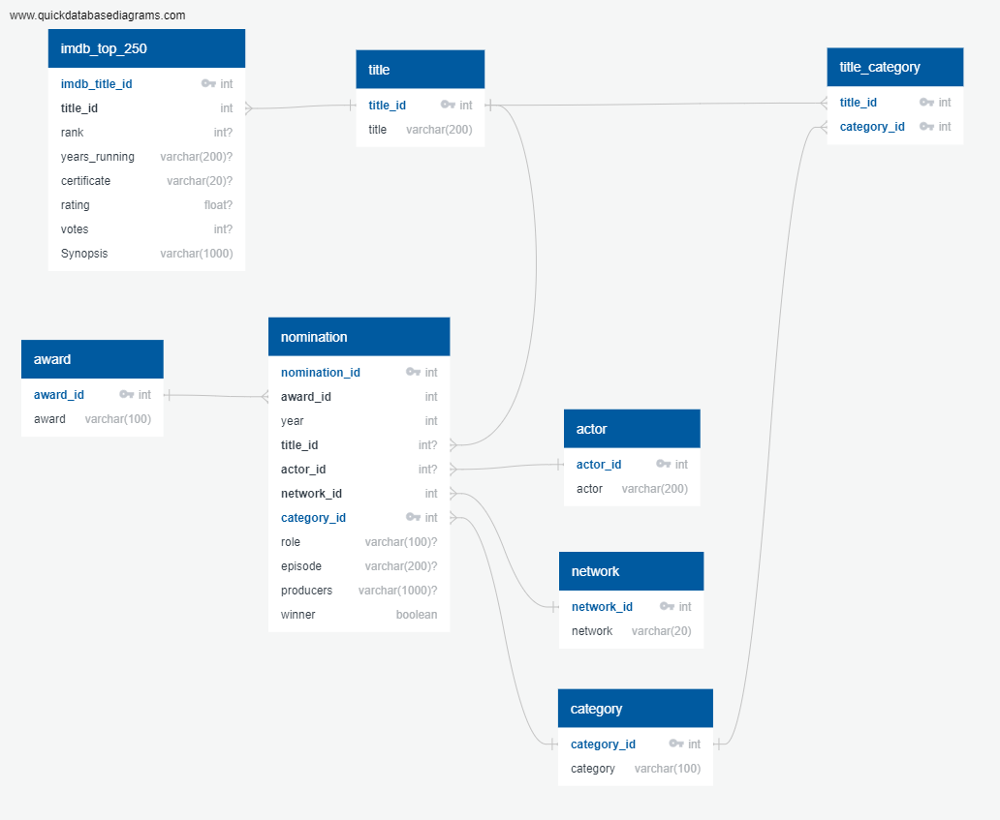

# ETL_IMDB

For this project we created relational database for top 250 IMDB TV series and  emmy awards for these series if any for the years 2010-2022.

   

## Extraction

- For the first source, IMDB <https://www.imdb.com/list/ls008957859/> was scraped to get the data for the title,rank,actors,synopsis, votes, rating etc. The code for scraping can be found [here](ETL_IMDB\Extraction\IMDB_Scrape.ipynb) and the resulting dataset can be located [here](ETL_IMDB\Transformation\Resources\IMDB_cleaned_Top_250.csv)

- For thr csv files of the emmy award winners and nomination across various categories , we used Pandas function `pd.read_html` and got 7 files across the years 2010-2022 which can be loacted [here](https://github.com/joshi-swetam/ETL_IMDB/blob/main/Extraction/IMDB_Scrape.ipynb)

## Transformation
For the transformation step following steps were followed: 
-  read data from extracted csv files from [Resources](Resources) folder
- transform data to generate relational model
- save tranformed data to csv file in [output](output) folder

## Load

- https://www.quickdatabasediagrams.com/ was used to create [erd](erd) diagram 

- Imdb [schema](Load\schema.sql) was created using Postgresql and pgADMIN 4 
 - Basic queris such as select titles, rank and rating  and winners yearwise based on  the category from titles and top 250 tables were [performed](Load\Queries.sql).
